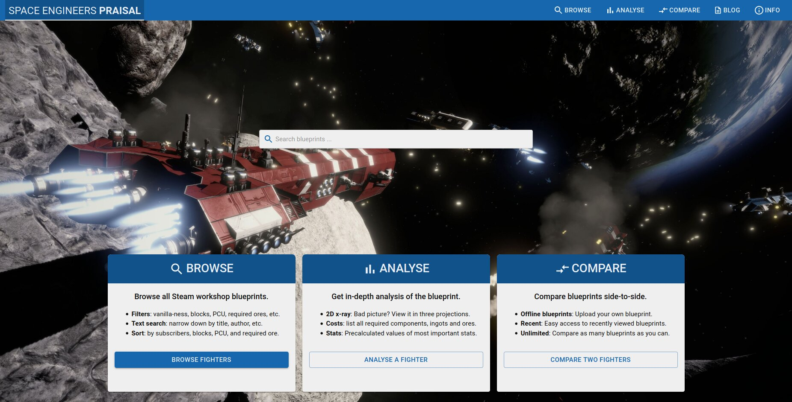

## SE Praisal V2 launched!

Today the version 2 of [Space Engineers Praisal](https://spaceengineerspraisal.net) is launched!

With SE Praisal, you can [analyse](/analyse) or [compare](/compare) side-to-side any SE blueprint - either from Steam Workshop or uploaded by yourself.
Furthermore, there are pre-analysed 100,000+ blueprints that you can [browse and filter](/browse).

This day is also 3rd anniversary since my [first commit](https://github.com/Akuukis/spaceengineers-praisal/commit/c14ba7ba6e26a8a59af40b5cf5cc41a903d76a52). Compared to version 1 (Dec, 2017) the difference is significant: pretty as never before, analysis are much more informative, and you can even search for blueprint with many filters because there's a database now with the whole Steam Workshop pre-analysed.

That's all now - go **use it**, **share it**, and let me know how you like it. See you on Discord ;)

> https://spaceengineerspraisal.net

