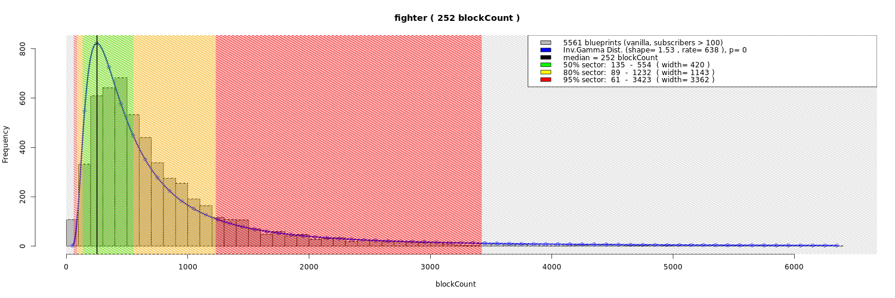
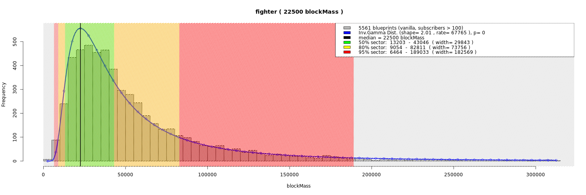
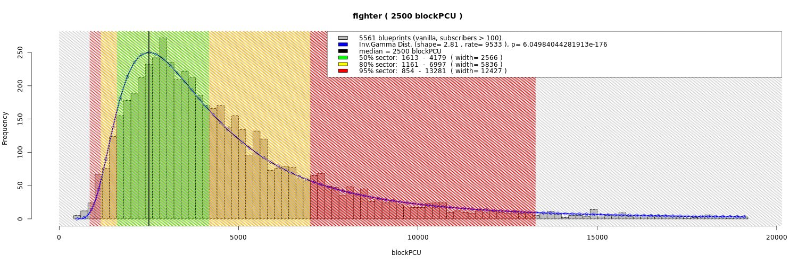
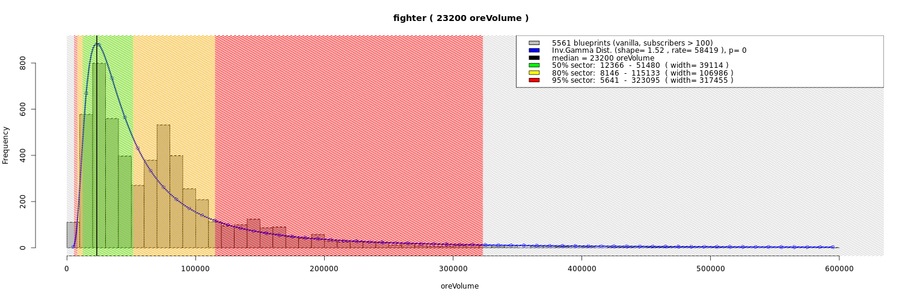

### How does SEPraisal categorize all blueprints?

SEPraisal plans to categorize blueprints in three levels:
- Primary level is type: **V**ehicle or **B**uilding
- Secondary level is size **C**lass: from C1 to C8
- Tertiary level is purpose.

Let's go through this with this (TODO: link) blueprint.
First, the automatic logic downloads and analyses it.
Second, script checks grid type that is "dynamic", so script concludes it is a Vehicle (V).
Third, script checks it against class size definition (more on it below) - and classifies blueprint as size Class 1 (C1).
Fourth, script checks it against several purpose definitions within that class - and assigns to it the "Fighter" purpose.
So, blueprint is classified as "VC1 Fighter".

For the starters, SEPraisal have only filter presets for "Vehicle", "Vehicle Class 1", and "VC1 Fighter".
On the other hand, SEPraisal has many filters and you should be able to combine almost anything you may need.

Here's some more examples how it would generally look:
- VC1 is tiny small-block vehicle: Torpedo, Missile, Drone, etc.
- VC2 is small small-block vehicle: Fighter, Bomber, Scout, Dropship, etc.
- VC3 is medium small-block vehicle: Heavy Fighter, Heavy Dropship, etc.
- VC4 is medium large-block vehicle without jump drive: Corvette, etc.
- VC5 is large large-block vehicle: Industrial Frigate, Torpedo Frigate, etc.
- VC6 is huge large-block vehicle: Destroyer, Cruiser, Carrier, etc.
- VC7 is enourmous large-block vehicle that's guild-effort: Battleship, Dreadnought, etc.
- VC8 is ridiculous large-block vehicle that's killing the server performance-wise. No examples.

I came up with these categories by reading all categorization guides on Steam Workshop.
They mostly concern with size and purpose/role, and mostly agree with each other.
But they propose only ship categorization, therefore I expanded categories to cover not only ships.
Also I focused on those properties of blueprint that are possible to categorize automatically (sorry, no aesthetics here!).

Categorization is not even close to be finished.
I assume most could agree that a given vehicle class includes the few examples above.
But there's yet much to explore and analyse until we can arrive at exhaustive list of purposes within each VC.
If you want to help, please contact me and let's talk!

### How SEPraisal determines "size" of each size class?

SEPraisal defines "size" as a combination of 4 properties:
- Block count
- Dry mass
- PCU
- Ore volume (that's required to build blueprint)

SEPraisal statistically analyses whole Steam Workshop to find out the exact numbers for each size class.
Read on for nice charts and more details.

In a simplified version, for each size class, the analysis goes like this:
1. Define few class-specific filter criteria (e.g. small blocks vs large blocks)
2. Add several search keywords for expected blueprints in that class (e.g. "fighter" for VC2)
3. Filter whole Steam Workshop
4. See how many blocks (or mass, PCU, ore volume) the results have
5. Find a range for the most typical results (80%)

There's quite a lot statistics involved, but here's a nice chart on how many block count has "VC2 Fighter":

The bars are frequency of block count amount and the blue line shows an approximated model of the results.
The colors show zones of "typicality".
For example, blueprints in green area (135 to 554 blocks) are the most typical ones - half of blueprints are in this area.
**4 out of 5 blueprints are in green and yellow area (103 to 1,197 blocks). They are typical enough to be considered "VC2 Fighter"**.
The remaining 15% falls in red zone, 3% in grey zone, and 2% are off the chart.

Here's the rest of "VC2 Fighter" charts for mass, PCU and required ore volume:

